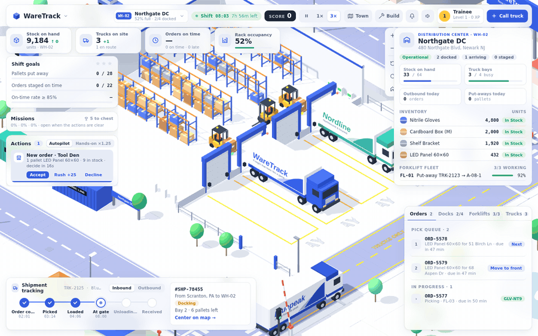
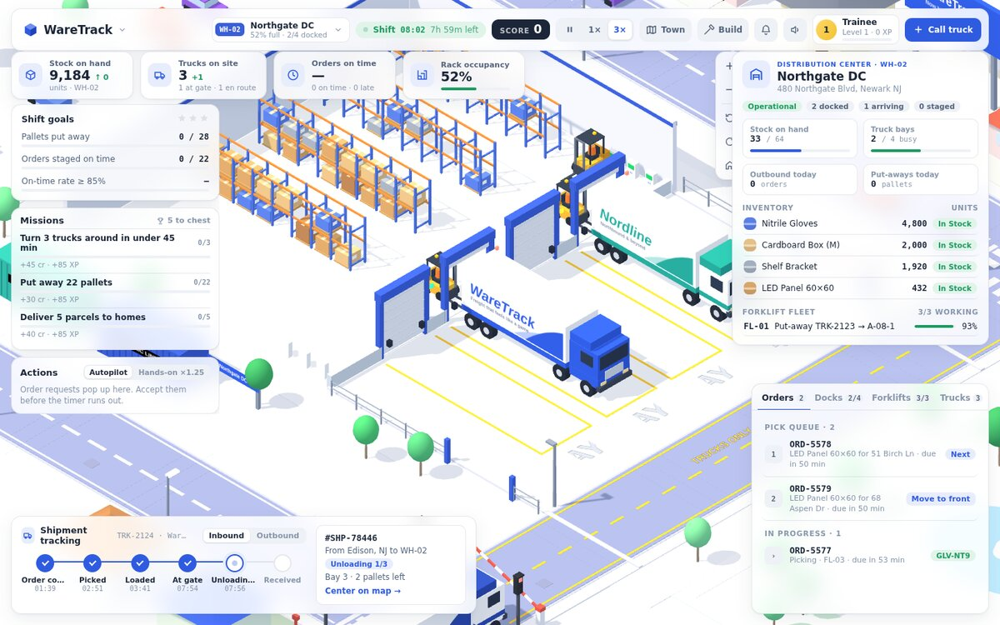
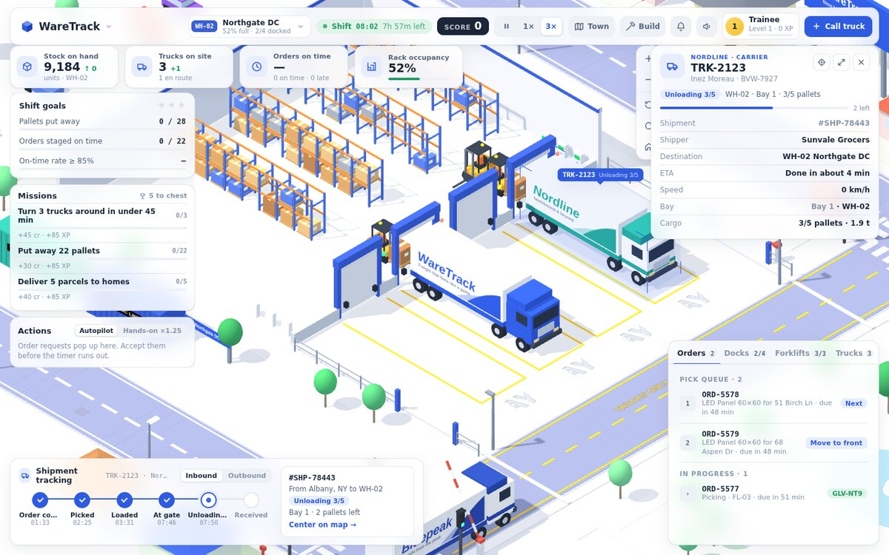
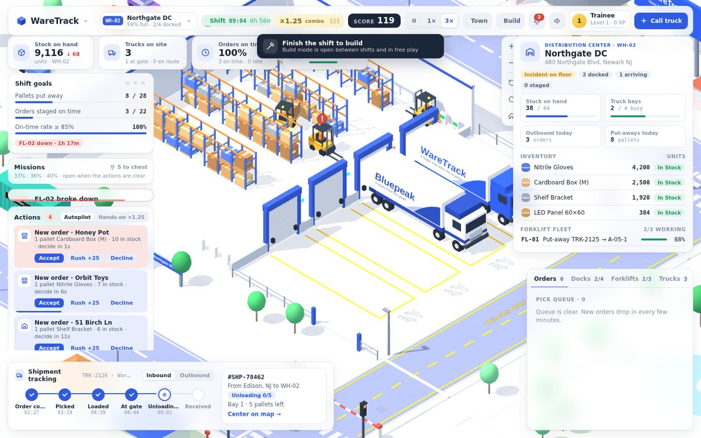
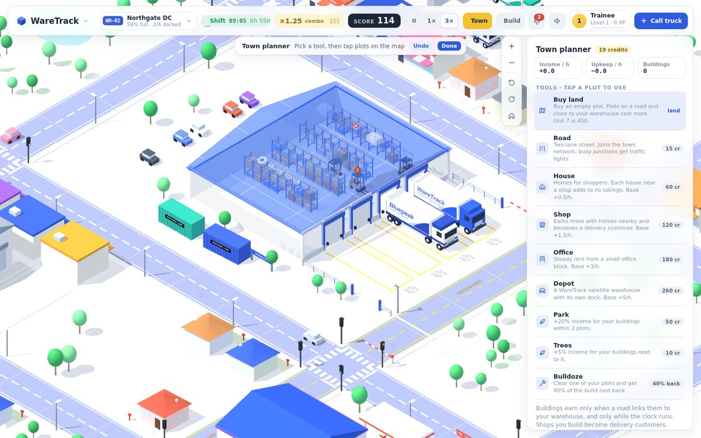
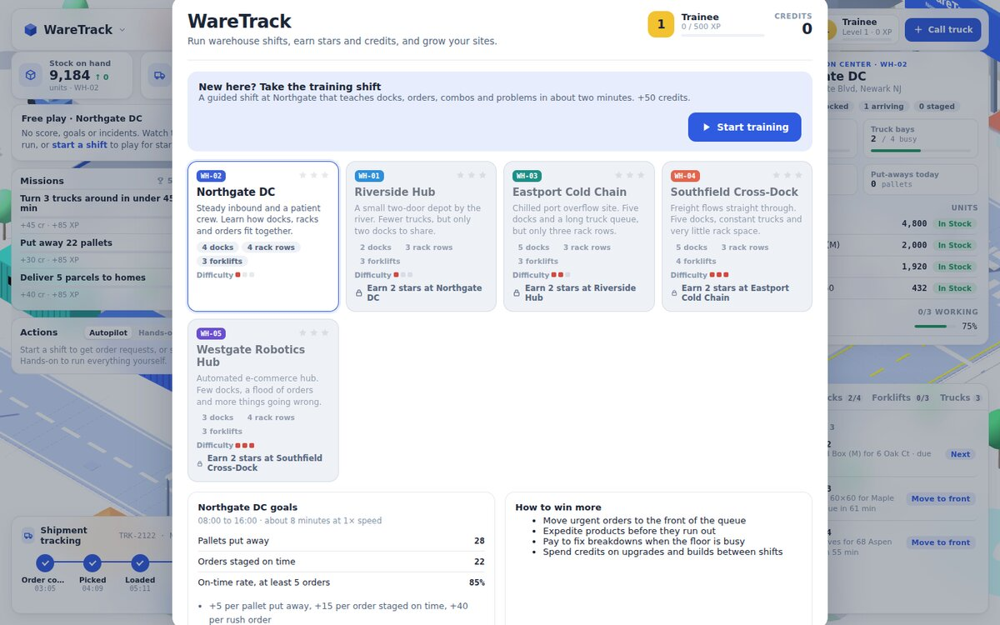
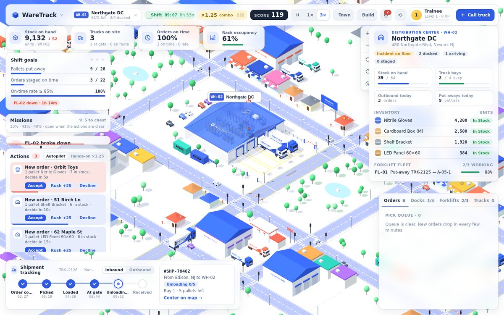

# WareTrack

**Play it:** https://siddik-web.github.io/waretrack/

A 3D warehouse strategy game that runs in the browser. Manage a distribution center like a strategy game: trucks dock, forklifts put pallets away and pick orders, problems pop up, and you decide how to handle them. Around the warehouse is a town you can buy and build.

Everything lives in a single file, `index.html`. It uses [three.js r128](https://threejs.org/) from cdnjs and Google Fonts. There's no build step and no backend.

<p align="center">
  <a href="https://siddik-web.github.io/waretrack/"></a>
</p>

## Screenshots

| | |
|---|---|
|  |  |
| **Running a shift:** goals, live stock, docks, forklifts and the pick queue | **Inspector:** tap a truck to see its shipment, bay and ETA |
|  |  |
| **Order requests and problems:** decide before the timer runs out | **Town planner:** buy land, lay roads and put up buildings |
|  |  |
| **Five warehouses:** unlock each one with stars at the previous site | **A living city:** streets, homes, shops and traffic around every site |

## Play locally

Open `index.html` in a browser, or serve the folder:

```bash
npx serve .
# or
python3 -m http.server 8000
```

## Features

- **Warehouse simulation:** trucks queue at the gate, back into docks and unload. Forklifts route through aisles, lift to rack levels, charge their batteries, and pick orders to outbound staging.
- **Shifts and scoring:** 8-hour shifts (about 8 minutes at 1× speed) with three goals, stars, order combos and a points ledger.
- **Five warehouses in one live world:** Northgate DC, Riverside Hub, Eastport Cold Chain, Southfield Cross-Dock and Westgate Robotics Hub sit side by side on one road network. You run one site in full detail; the other four keep working on their own, with trucks queuing, docking, unloading or loading outbound freight, and yard forklifts moving pallets. Each site has its own building style (gable roof, cold store with silos, sawtooth cross-dock, solar-roofed robotics hub). Unlock each one with 2 stars at the previous site.
- **Problems with choices:** breakdowns, spills, rush orders, late trucks, order surges and low stock.
- **Progression:** XP and 8 ranks, 24 achievements, a daily challenge with streaks, upgrades, cosmetics, and a build mode for each warehouse.
- **Order requests and Hands-on mode:** during a shift every new order pops up with a 16-second timer: accept, rush or decline, or lose the customer. Switch to Hands-on to dock every truck, release every order and send every van yourself for 1.25× points.
- **Missions, streaks and rewards:** three rotating missions with credit and XP rewards, a chest every five missions, an on-time delivery streak that raises every fee, and pay for the time you were away.
- **Bigger world and new music:** North and South districts with new streets and homes (opened by hiring a fifth driver), and a synthesized soundtrack that shifts from calm free play to an upbeat shift theme and a faster rush theme in the last hour or when trouble hits.
- **Connected network:** WareTrack transfer trucks drive stock between your five warehouses on the public roads. Request a transfer from the Stock tab when a product runs low (cheaper but slower than expediting), and follow it with Transfer tracking.
- **Customers across the city:** orders go to every shop and house around the site you run. Shipment tracking → Outbound follows each order from the pick queue to the door, and tapping a shop or house shows its open orders and delivery history.
- **Delivery business:** every shipped order becomes a van delivery with a promised time. Early drops earn a tip, late ones half pay, and a customer rating scales every fee. Each trip costs a little to run, and jobs wait at the depot when all vans are out. Spend credits in the Vans tab on staff (more drivers, driver training, a dispatcher) and tools (scanners, route planner, bigger vans, electric vans) to deliver faster and earn more.
- **Town planner:** buy plots, lay roads, and put up houses, shops, offices, depots and parks. Buildings linked to the warehouse by road earn credits, and shops you build become delivery customers. You can also buy the empty Unit 7 to run a second warehouse.
- **Traffic rules:** right-hand driving, lane-following, traffic lights with amber and all-red phases, safe following distance and left-turn yielding. The game's trucks and vans obey them too.
- **Inspector and selection:** tap a truck, forklift, dock bay, charger or pallet to see its details. Selected items get blue corner brackets, a label, and a route line with a destination pin. The follow camera tracks moving vehicles.
- **Site switcher and notifications:** the camera flies between warehouses from the top bar (between shifts, the site you fly to becomes the one you run), or zoom out to a network overview with map pins for every site. Tap any truck, forklift, dock or building at another site to inspect it; the bell lists problems, achievements and promotions.
- **Training shift, sound and juice:** a guided first shift, synthesized sound effects and music, floating points and confetti.

## Controls

| Input | Action |
|---|---|
| Drag / pinch / scroll | Pan and zoom |
| Tap a truck or forklift | Inspect it |
| `Space` | Pause or resume |
| `1` / `2` | Choose an option on a problem card |
| `B` | Build mode |
| `T` | Town planner (`Ctrl/Cmd+Z` to undo) |
| `M` | Menu |
| `/` | Search |

## Saves

Progress (stars, credits, upgrades, builds, town, achievements) is stored in the browser's `localStorage` under `waretrack.game.v2`. Clearing site data resets it. There is also a reset button under Menu → Profile.

## Deploy

It's a static site, so any static host works (Vercel, Netlify, GitHub Pages). With Vercel, import the repo with no framework preset and no build command.

## Game rules spreadsheet

`WareTrack_game_rules.xlsx` lists every warehouse, scoring rule, problem card, action, upgrade, the delivery rules and delivery upgrades, and the traffic rules, plus a shift calculator for estimating score, stars and credits.
